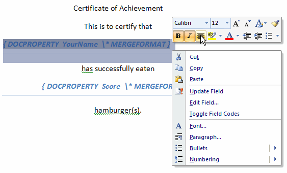

---
title: About Reporting in Aspose.Words for SharePoint
type: docs
weight: 10
url: /sharepoint/about-reporting-in-aspose-words-for-sharepoint/
---

With Aspose.Words for SharePoint, you can fill documents with data from external data sources such as databases, SharePoint lists or XML data files. You can save the result in any [supported document format](/words/sharepoint/multiple-format-support/). We call this feature *reporting* and the final document, filled with data, a *report*.

Reporting is built on top of [Aspose.Words' mail merge feature](). However, Aspose.Words is a class library and you can use it only programmatically. Aspose.Words for SharePoint provides a user interface for making reports from templates stored in a SharePoint document library. You can specify saving format and location through the interface, as well as report parameters.

A [report template](/words/sharepoint/report-template-and-merge-fields/) is a Microsoft Word file with placeholders defining where to insert data from the report data source. Regular Microsoft Word mail merge fields serve as placeholders. However, Aspose.Words does much more than the standard Microsoft Word mail merge. You can:

- [Define template regions to repeat for each data record in a data source](/words/sharepoint/merge-regions/).
- [Use nested regions to reflect parent-child relations in the data](/words/sharepoint/nested-regions/).
- [Insert images instead of merge fields](/words/sharepoint/merge-fields-for-inserting-images/).

Changing the visual report layout is very simple. Just use Microsoft Word to change the report template.

**Change the report template layout in Microsoft Word.** 

The report template also specifies where to find the [data source definition](/words/sharepoint/linking-report-template-with-report-definition/). In Aspose.Words for SharePoint, the data source definition is a separate XML file, which describes database connections and queries to retrieve data. Currently the following data sources are supported:

- [SQL queries from data sources supported by OLE DB data providers. For Microsoft SQL Server you can use .Net SQL data provider](/words/sharepoint/sqlquery-element/).
- [SharePoint lists via CAML queries](/words/sharepoint/splistquery-element/).
- [XML data files located in a SharePoint document library](/words/sharepoint/spxmlquery-element/).

There are two sets of tasks when using Aspose.Words for SharePoint reporting. A [report user](/words/sharepoint/user-interface-for-creating-reports/) can

- Generate reports from templates and data source descriptions stored in SharePoint document libraries.
- Save the generated reports in any of the supported formats.
- Edit report template to change the layout using Microsoft Word.

A report designer does not need to write the code to get data from a data source. However, he needs to author an XML data source definition where he can

- Describe [data source connection details](/words/sharepoint/datasource-element/).
- Describe [queries to obtain data from a data source](/words/sharepoint/queries-element/).
- Describe [relationships between query results](/words/sharepoint/relations-element/).
- Describe [report parameters](/words/sharepoint/parameters-element/).

You can also build reports from templates programmatically with a few lines of code using Aspose.Words.SharePoint.Reporting namespace.
