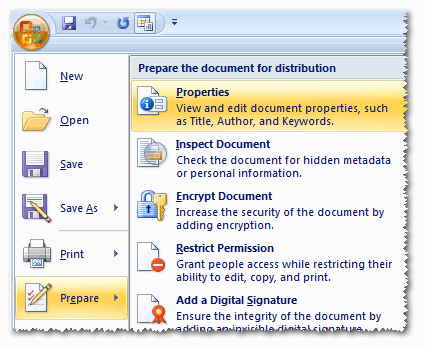
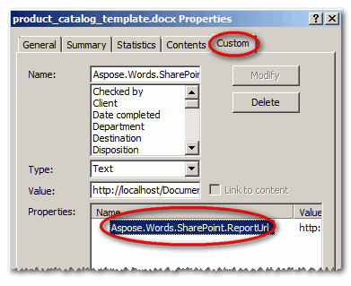
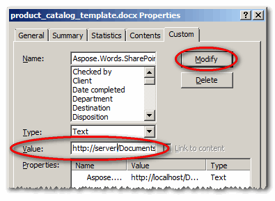
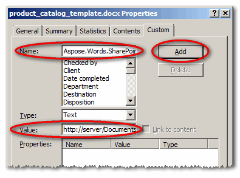
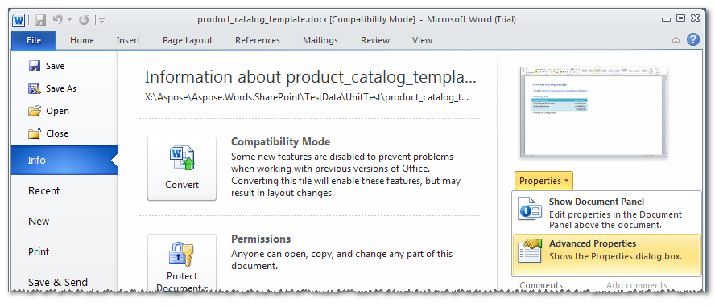

---
title: Linking Report Template with Report Definition
articleTitle: Linking Report Template with Report Definition
linktitle: Linking Report Template with Report Definition
description: "This guide describes how to link report template with the report definition while configuring Aspose.Words for SharePoint reports."
type: docs
weight: 60
url: /sharepoint/linking-report-template-with-report-definition/
---

A report template does not have a description of data source connection inside. Instead, there is a link to a report definition file stored in a SharePoint document library. Report definition is an XML file, which describes things like data source connection details, queries to retrieve data, report parameters, data relationships and so on.

You should store the link to the report definition in a custom document property named **Aspose.Words.SharePoint.ReportUrl**. To edit this property, follow these steps for Microsoft Word 2007 (see below for the slightly different steps in Microsoft Word 2010):

1. Open a report template in Microsoft Word.
1. Select **Prepare** and **Properties** from the **Office** menu.
   1. **Selecting Properties** 

1. Select **Advanced Properties** from the **Document Properties** menu to open the document properties dialog. 
   **Selecting Advanced Properties** 

1. In the document properties dialog, select the **Custom** tab.
1. Select **Aspose.Words.SharePoint.ReportUrl** from the **Properties** list. 
   **The Properties list on the Custom tab** 

1. Edit the report definition URL in the in the **Value** field. On changing the value, **Modify** button becomes enabled.
1. Click **Modify** to save the changes. 
   **Setting the value** 
 
If there is no **Aspose.Words.SharePoint.ReportUrl** property, you can add it in the same dialog by typing the name in the **Name** field, editing **Value** and then pressing **Add** button. 
**Adding the Aspose.Words.SharePoint.ReportUrl property** 
 
The steps to get to the document properties dialog are slightly different for Microsoft Word 2010.

1. Select the **File** tab and then **Advanced Properties** from the **Properties** menu on the **Info** tab. 
   **Selecting Advanced Properties** 

1. This will produce the document properties dialog. Follow the steps for Word 2007 above starting from step 4.
