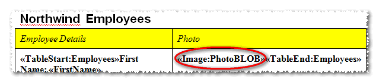

You can insert images from a data source in the report. Image merge fields must have names starting with **Image:** in the report template. The name part after colon should match the data source field (table column) that holds the image data, just like the names of other merge fields.

**A report template with an Image: merge field** 

**An employee photo is inserted in the report instead of the Image: merge field** 

## Related Articles

- [Report Template and Merge Fields](/words/sharepoint/report-template-and-merge-fields/)
- [Merge Regions](/words/sharepoint/merge-regions/)
