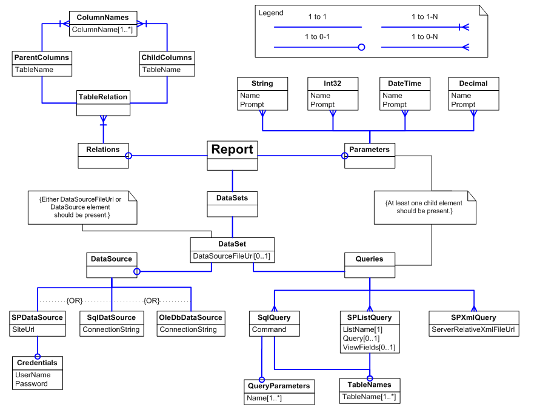

---
title: Report Definition Overview
description: "This page describes report definition file meaning, it's structure and how to work with a such file while configuring Aspose.Words for SharePoint reports."
type: docs
weight: 10
url: /sharepoint/report-definition-overview/
---

The report definition file is an XML file that describes details about the report that the report template does not cover: it defines everything except the visual report layout. This includes:

- Data source connection properties.
- Queries to retrieve the data.
- Relationships between data tables returned by different queries.
- Report parameters.

{}

A [report template](/words/sharepoint/linking-report-template-with-report-definition/) must have a link to the report definition file.

{}

When designing a report for Aspose.Words for SharePoint, you need to create a report definition file. Currently, there is no tool for editing report definitions, so you have to edit the raw XML. Think of the report definition file as a configuration file where you specify all the data retrieval details rather than coding them with the Aspose.Words API. If you do not need the fine level of control that the Aspose.Words class library offers, Aspose.Words for SharePoint may be more suitable.

**Report definition schema diagram.**

Look at the report definition diagram. The main section is [DataSets](/words/sharepoint/datasets-element/) that describes data source connection details and queries for retrieving data. A report can combine data from several queries and have several data source connections. For example, it is possible to get a query result from an SQL database and combine it with list of items from a SharePoint list. If data returned by different queries is related, describe the relationships in the [Relations](/words/sharepoint/relations-element/) section of the report definition file.

The [Parameters](/words/sharepoint/parameters-element/) section is used for report parameters description. All elements used in the report definition are defined in the &lt;https://docs.aspose.com/words/sharepoint/reporting/&gt; XML namespace. Elements have either child elements or a value stored as text element content. Elements with children do not use text content in the report definition. When the element has text content as a value, leading and trailing whitespace is trimmed from the text before usage. Consider this element:


<TableName>MyTable</TableName>


It has the same value (“MyTable”) as the element below.


<TableName>
	MyTable
</TableName>


The report definition schema file (Report.xsd) and data source definition schema file (DataSource.xsd) are included in the installation package for reference.
