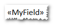

---
title: Report Template and Merge Fields
type: docs
weight: 20
url: /sharepoint/report-template-and-merge-fields/
---

You need a template document before you can generate a report. A template is a Microsoft Word document with placeholders defining where to insert external data. It does not have to be a Microsoft Word template (.dot or .dotx) file. A regular .doc or .docx document will work.

1. Select **Field** from the **Quick Parts** menu to open the **Field** dialog.
1. From the **Field names** list, select **MergeField**.
1. In the **Field name** text box, enter a name for the merge field and click **OK**.

**Creating a merge field** 

Now you have a new merge field placed in your document. Microsoft Word demonstrates it like this: 

**A merge field in a document**

Of course, since a merge field is a regular Microsoft Word field, you can switch between displaying field codes and results in your document in Microsoft Word using the keyboard shortcut Alt+F9. Field codes appear between curly braces: 

**The field code exposed** 

You can edit merge field name and format switches if needed.

1. To open the **Field** dialog in Microsoft Word 2003, you need to open the **Insert** menu and select **Field**. 
   **Opening the Field dialog** 

**An example of a tabular template with a few field codes**

