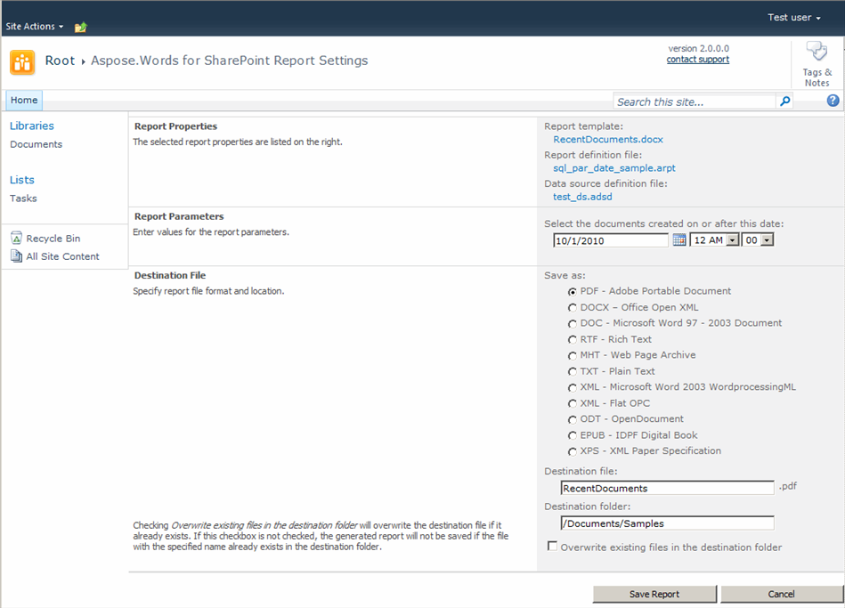

Aspose.Words for SharePoint lets you create a report with Aspose.Words for SharePoint. This article explains how.

## Creating a Report

To make a report:

1. Select a report template in a SharePoint document library.
1. Click **Make Report via Aspose.Words** in the template’s Edit Control Block. 
   **Selecting Make Reports vie Aspose.Words** 

1. In SharePoint 2010/2013/2016, you can find **Make Report via Aspose.Words** button on the ribbon. The button is active when you select a single file. 
   **Selecting Make Report via Aspose.Words from the ribbon** 
 
The report settings screen is displayed. The following options are available:

1. If the report has parameters, the **Parameters** section is present. Enter the required parameter values of the appropriate type.
1. Select the destination format from the **Save as** list.
1. Enter the destination file name in the **Destination file** box. By default, Aspose.Words for SharePoint prepopulates this field with the name of the report template file. The extension is added automatically depending on the selected format.
1. Enter the URL of the destination library folder in the **Destination folder** box. It can be a folder in a different site collection. The default value is where the report template is located.
1. Check the **Overwrite existing files in the destination folder** option to replace an existing file with the report in case of a name clash. By default, existing files are not overwritten. If this box is checked:
   1. When the destination library has versioning enabled, a new file version is added for a conflicting file.
   1. When versioning is not enabled for the destination library, an existing file with a conflicting name is overwritten.
1. Click **Save Report** to build and save the report, or
1. Click **Cancel** to go back to the document library.

## The Report Settings Screen

After saving the report, another screen is presented. It lists the options and parameters used. You can return to the library where the report template is located, go to the destination library or use the hyperlink to open the saved report.

**Report properties**

**Open the saved report** 

