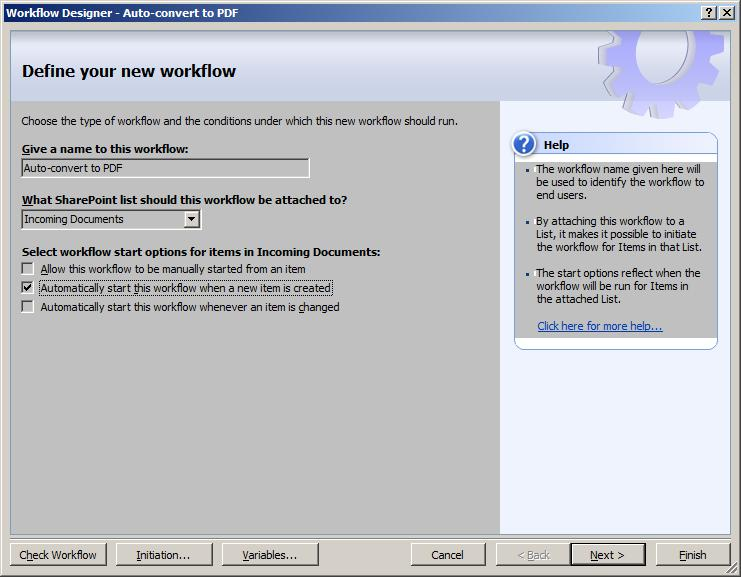
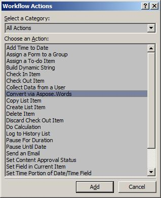
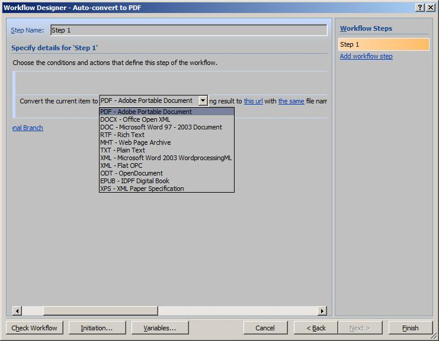
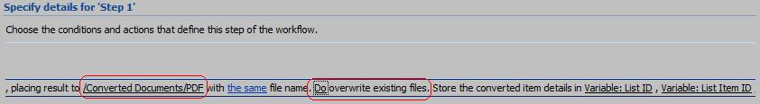
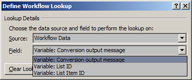
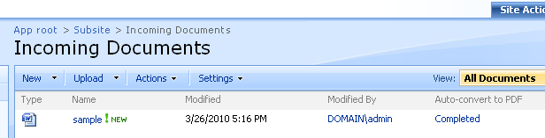
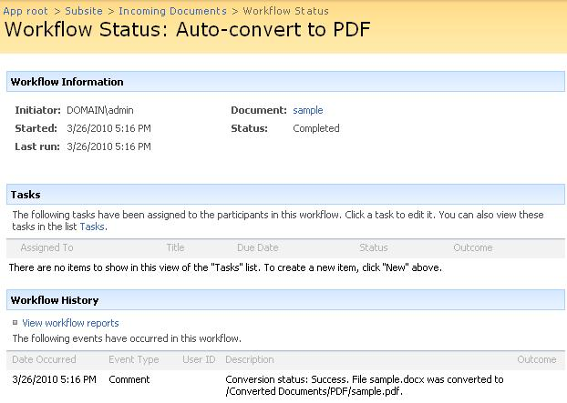

---
title: Converting a Document via Workflow Activity
description: "This article explains how to use SharePoint Designer to create a workflow for converting documents while using Aspose.Words for SharePoint."
type: docs
weight: 20
url: /sharepoint/converting-a-document-via-workflow-activity/
---

This article explains how to use SharePoint Designer to create a workflow for converting new documents to PDF and storing the results in another document library.

## Select Source and Destination Document Libraries

First choose the source and destination document library for converting documents. For this example, we want to convert all new documents in a library called “Incoming Documents” and store the converted documents in a library called “Converted Documents”, placing the result in the “PDF” subfolder. To reproduce this example, create these libraries in a SharePoint site you use for testing. Alternatively, use existing libraries instead of the suggested example libraries. When a workflow is executed, it has the permissions of the user who initiated it. So in order to store the converted documents, users need permission to add and update documents in the destination library.

## Create a New Workflow

To create a new workflow:

1. Start SharePoint Designer and connect to the site where the source document library is located.
1. Select **New** and **Workflow** from the **File** menu.
   The workflow designer window appears.
1. Attach the workflow to the "Incoming Documents” library by selecting it in the document library list.
1. Select **Automatically start this workflow when a new item is created**.
1. Clear the other options to run this workflow for new documents only. 
   **Creating a new workflow.** 

1. Give the new workflow a descriptive name. 
   **Add the Convert via Aspose.Words action to your workflow**
1. Clicking **Next**. 
   A workflow steps editor appears.
1. Add an action that tries to convert every new document without any conditions.
1. Click **Actions** and select **Convert via Aspose.Words** from the list. You may need to select **More Actions** to produce the complete action list. 
   **Selecting conversion action.** 

## Configure Action Parameters

The parameters of the workflow action are similar to the conversion settings available when launching conversion via Aspose.Words from a document library:

- **Destination format**. You can use all formats supported by Aspose.Words for SharePoint in a workflow.
- **Destination folder URL**. This is where the converted document is placed. If this parameter is not set, conversion result is placed in the same folder with the source file.
- **Destination file name**. Specify this parameter to give the converted file a different name. If this parameter is not set, the converted file will have the same name as a source file. An extension is added according to the specified destination format.
- Whether the existing files in the destination library should be overwritten by the conversion result. By default, conversion does not overwrite existing files.

**Selecting destination format.**

1. For this example, type in the server-relative URL of the destination document library folder.
1. Leave the destination file name parameter at the default (“the same file name”).
1. Select **Do overwrite existing files** to overwrite existing files in the destination folder with the conversion result.
   **Setting other workflow action parameters.**

## Use Action Output Parameters in Other Actions

The conversion action sets three workflow variables on execution:

- **List ID** is the ID of the list where the converted file is saved.
- **List Item ID** is the id of the document item in the destination list. Use these two parameters in subsequent actions when you need to do something with the converted file.
- **Conversion output message** is a textual description of conversion outcome.

Add another action using one of the conversion output parameters as an argument.

1. Click **Actions** in the workflow designer to add another action and select **Log to History List**.
1. Click **this message** in the action sentence and the ***fx*** button next to it to set the message to the conversion output.
1. Select **Workflow Data** as a source and **Variable: Conversion output data** as a field. 
   **Using action output as a parameter for another action.** 

1. Click **Finish** in the workflow designer window to save the new workflow. 

## Test the New Workflow

Now let us see how it works.

1. Start a browser and go to the “Incoming Documents” library to which our new workflow is attached.
1. Upload a new document.
   Make sure that document type is supported by Aspose.Words (DOCX, DOC, RTF, MHT, XML, Microsoft Word 2003 WordprocessingML or Flat OPC).
   The workflow should start automatically.
1. Refresh the browser window. A new column with the workflow status should appear: 
   **Workflow status column displayed in a document library.** 

1. Click **Completed** in the workflow status column to see that a conversion outcome message was logged to the workflow history. 
   **A workflow history entry.** 

1. Go to the destination library and find the converted document there.

If a user with insufficient permissions to update the destination library has started the workflow, it still completes successfully, but the failure is logged in the workflow history:

## Unsuccessful Conversion Logged in the Workflow History

