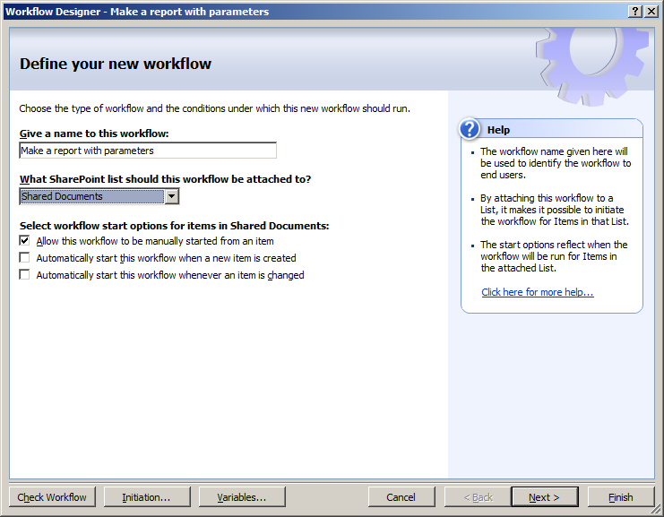
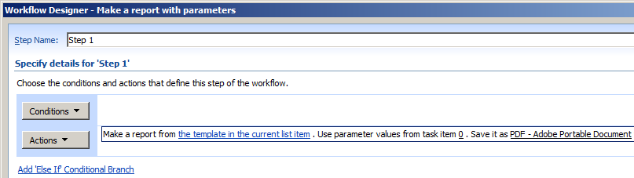
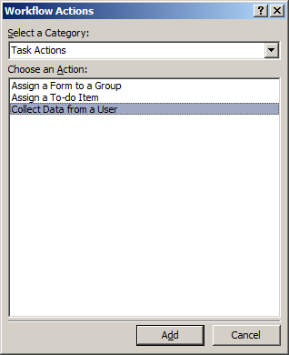
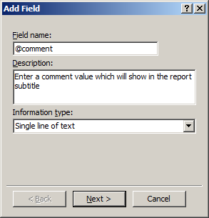
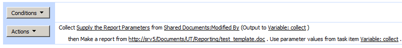
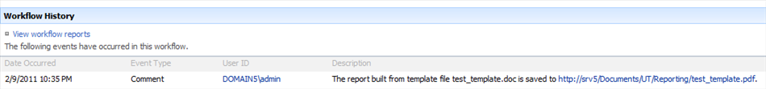

This article walks you through creating a workflow for building a report with parameters. The steps and screenshot are for SharePoint Designer 2007. The steps for SharePoint 2010/2013/2016 are very similar:

1. Start SharePoint Designer, open a site and create a new workflow.
1. Name the workflow and associate it with a document library. 
   Creating a new workflow. 

1. Add the **Make a Report via Aspose.Words** activity to the workflow. 
   Adding workflow activity for making a report. 
 
By default, the report template is taken from the current list item. 
 
However, this example uses a fixed URL set to the report template by editing the first workflow parameter. 
The report template URL is specified in the activity parameter. 

1. Assume that we need to provide the report parameter values during the workflow execution. Do so through the built-in **Collect Data from a User** SharePoint activity. 
   Adding the activity for collecting parameter values. 

1. Move the added activity up in the workflow sequence so that it executes before building the report.
1. You specify what data to collect in the activity “data” parameter. 
   When the activity executes, a task is created in the workflow task list and is assigned to the specified user. 
   The task configuration wizard is started on clicking the “data” parameter of the collection activity. 
 
For example, if the report is expecting two parameters, configure the data collection activity to get two fields. The field names must match the parameter names in the report definition. Here is a fragment of the report definition with parameter description. 

    <Parameters>
    <String>
      <Name>@comment</Name>
      <Prompt>This is a test report parameter of type string</Prompt>
    </String>
    <Int32>
      <Name>@numericValue</Name>
      <Prompt>This is a test numeric report parameter</Prompt>
    </Int32>
    </Parameters>
 
Configuring the field for the @comment parameter in the data collection activity. 
 
Data collection activity with two fields added for report parameters. 
 
Please note that field names in the data collection activity match the parameter names in the report description. You can specify the user who will provide the parameter values in the “user” parameter of the data collection activity. The user will enter the parameter values and complete the task during workflow execution. 
A form for entering parameter values generated by the data collection activity. 

1. Link the collected data to the report generation activity by setting the parameter task item ID in the report activity to the output parameter of the data collection activity. The data collection activity output parameter is named “collect” by default and can be accessed via workflow variables. 
   Defining a workflow lookup to the data collection output parameter. 
 
Data collection output linked to the report input in the workflow. 

1. Most of the remaining report activity parameters are similar to the conversion activity. Specify the format to save the generated report, destination folder and file name.
   1. If the destination folder is not specified, the report is saved to the folder where the report template is.
   1. If the file name is not specified, the report gets the same file name as the report template and an extension according to the specified saving format. You can choose whether to overwrite the existing files in case of name clash. However, the report template from which the report is created is never overwritten. 
      The default input parameter values of the reporting activity. 

1. By default, the activity logs its output to the workflow history list. You can switch the logging off.
1. **The activity outcome is logged to the workflow history list.**

1. The list ID and item ID of the created list item are saved in the activity output parameters. You can use them in subsequent workflow actions.
